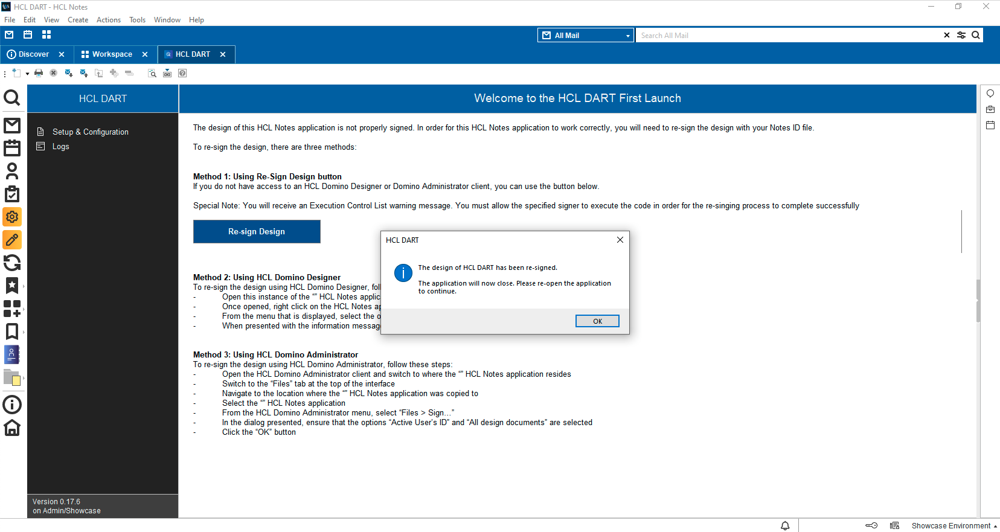
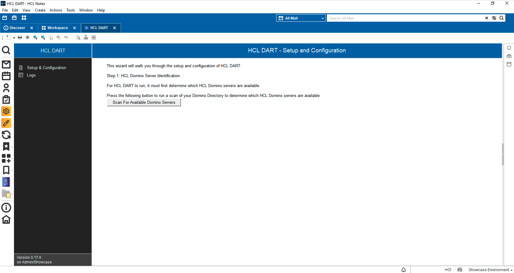

<h1>How to Deploy and Update HCL DART</h1>

  

    Table of contents
  

  {: .text-delta }
1. TOC
{:toc}

___
## Prerequisites - Download Template
Prior to continuing through this documentation, you will need to download the HCL Domino Application Reporting Tool (HCL DART) template into your Notes Data directory.

[Download Latest Release](https://github.com/HCL-TECH-SOFTWARE/dominio_application_reporting_tool_DART/releases/latest){: .btn .btn-green }

Please verify if your environment meets the [system requirements](requirements.md) before attemting to deploy HCL DART

## Step 1 - Create the Application from the Template
Save the [NTF](https://github.com/HCL-TECH-SOFTWARE/dominio_application_reporting_tool_DART/releases/latest) from the latest release to your Notes Data directory. Once it is there, open the HCL Notes Client and proceed to File - New Application.

In the resulting dialog, in the top section, choose a HCL Domino server to place the main HCL DART application onto, for the Title use `HCL DART` and the file name of `HCLDART.nsf`. If you wish to place the HCL DART application into a folder, add the folder name before the file name (as seen in the example image).

In the template section, select `Local` for the Server and then locate the `HCL DART` template in the list. Once this is done, select the `OK` button to finish the creation of the application. Once the creation is complete, it will launch and you can proceed.

___
## Step 2 - Sign the Design
Now that the HCL DART application is created, it is now time for you to re-sign the design.

It is required to sign the design elements in order for the environment scans to run in the background.

Once HCL DART is open, you should see the screen below which contains instructions on how to resign the design of the utility:

Depending on your experience level and how much you want to monitor the re-signing process, select the appropriate method listed.

Once the design has been re-signed, you will be presented with the following screen. You will now need to close and re-open HCL DART:

___
## Step 3 - Re-Open to Continue
Now that the design of HCL DART has been re-signed, you will need to re-open the application to complete the deployment process. When you initially opened HCL DART a Domino application icon will have been added to your Workspace. Locate and open HCL DART.

Once opened, you will be able to proceed with the remainder of the HCL DART deployment.

____
## Step 4 - HCL DART Server Scan
If your HCL Domino server environment consists of multiple HCL Domino servers, you will now be able to select additional HCL Domino servers to be scanned by HCL DART. This is also the step in the deployment where the HCL DART Data Collector engine will be deployed onto the HCL Domino server. 

**Special Note: The HCL DART Data Collector is always deployed onto the HCL Domino server where HCL DART has been deployed.**

To begin this process, click the "Scan for Available Domino Servers" button, as shown below:

Once the Scerver Scan is completed, you will see the following screen with a list of all available HCL Domino servers, as shown below:

___
## Step 5 - HCL DART Data Collector Deployment
HCL DART's collection of data is performed in the HCL DART Data Collector. This must be deployed in order to collect the User Usage and Application Complexity data.

To begin this process, click on the "DEPLOY" button that is on the screen. You will be presented with a list of available HCL Domino servers that you can select for the Data Collector deployment, as shown below:

Select the HCL Domino servers that you want HCL DART to scan. If you do not select the HCL Domino servers at this time, you will have the opportunity to perform the deployment once HCL DART is completely deployed and running.

Once the HCL DART Data Collector has been deployed, you will see the following message. At this time, HCL DART has been successfully deployed and is beginning to collect the User Usage and Application Complexity data:

___
## Post-Deployment Usage and Configuration
Once HCL DART is successfully deployed, you can begin using the application. The various scans will be performed on the HCL Domino server(s) and be reported back into the HCL DART Data Collector. When you next open HCL DART, the applicaiton should appear as follows:

On the Navigator, you can click on "Open Data Collector" to review the information being collected.

If you wicsh to deploy the Data Collector onto additional HCL Domino server(s), select the HCL Domino server in the View and then click the Actionbar button titled `Deploy Data Collector`.

You can also modify some Configuration Settings within HCL DART by clickon on `Setup & Configuration` on the Navigator.

Once on the Configuration page, you will have the ability to change certain settings. Currently, there is the ability to list the Notes Names of users or identitieds that you do NOT want to collect User Usage data for. This is useful for ignoring usage from system accounts, such as Notes IDs that are used for signing the design of your Production Domino applications. Simply click the `+ / -` butotn to select the user names/identities from your HCL Domino directory, as shown below:

{: mx-auto }